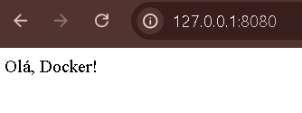

# Flask Docker Application

Este repositório contém a implementação de uma aplicação web simples utilizando Flask e contêinerizada com Docker.

## Objetivo

O objetivo deste trabalho é criar, configurar e executar uma aplicação web simples utilizando Flask, contêinerizá-la com Docker e documentar todo o processo.

## Etapas Realizadas

### 1. Criação da Aplicação Flask

A aplicação Flask foi criada com um endpoint simples, que retorna uma mensagem "Olá, Docker!" quando acessado na raiz do servidor.

### 2. Criação do Dockerfile
Um arquivo Dockerfile foi criado para definir a imagem Docker que executa a aplicação Flask. O Dockerfile define as etapas para:

Utilizar uma imagem base do Python.
Instalar as dependências necessárias (Flask).
Copiar os arquivos da aplicação para dentro do contêiner.
Expor a porta 8080.
Iniciar o servidor Flask.

## Conteúdo do Dockerfile:
# Usar uma imagem base do Python
FROM python:3.9-slim

# Definir o diretório de trabalho
WORKDIR /app

# Copiar os arquivos da aplicação para dentro do contêiner
COPY . /app

# Instalar as dependências
RUN pip install --no-cache-dir -r requirements.txt

# Expor a porta 8080
EXPOSE 8080

# Comando para iniciar o servidor Flask
CMD ["python", "app.py"]

### 3. Construção da Imagem Docker
# A imagem Docker foi construída utilizando o seguinte comando:
docker build -t flask-docker .

### 4. Execução do Contêiner
# O contêiner foi executado com o comando:
docker run -p 8080:8080 flask-docker
Isso faz com que a aplicação Flask seja acessível em http://localhost:8080 no navegador.

### 5. Verificação no Navegador
# A aplicação foi acessada no navegador utilizando o endereço http://localhost:8080, onde a mensagem "Olá, Docker!" foi exibida.

Abaixo está a captura de tela da aplicação rodando no navegador:

### Como Rodar a Aplicação
1. Clone este repositório:
git clone https://github.com/manuelalmartins/flask-docker.git
cd flask-docker
2. Construa a imagem Docker:
docker build -t flask-docker .
3. Execute o contêiner:
docker run -p 8080:8080 flask-docker

# Agora, você pode acessar a aplicação em http://localhost:8080.
